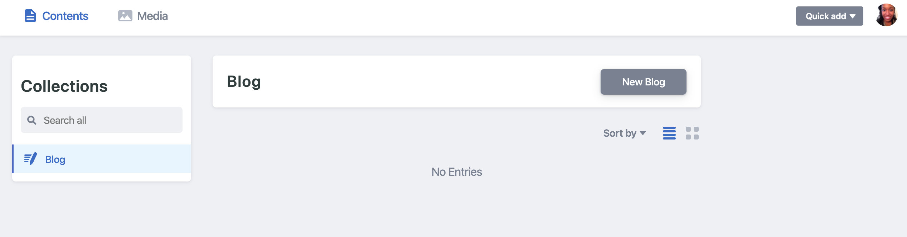

Netlify makes it SO EASY for developers at any skill level to build and manage a static websites.  If you're thinking of hosting a blog with Netlify as well, let me assure you that the Gatsby + Netlify CMS is the way to get this blog up and running in 10 minutes.  Add  blog articles is a breeze;  Netlify provides an admin dashboard that allows you to add future posts without having to spending time duplicating code over and over.



Let's start by adding a Gatsby blog to your existing Netlify site with a custom domain.  Here’s what you’ll need:

* Netlify site with custom domain (I purchased my domain from Netlify)
* Gatsby CLI Installed
* A GitHub account

Let’s start out with a simple Gatsby blog.  Gatsby provides a simple, yet elegant, starter blog for you to work with.

### **Creating your Gatsby blog:**

1.  In your terminal, type the following command to create a new Gatsby blog site using gatsby-personal-starter-blog.  `[your-project-title] `should be the name of your blog (so...whatever you want it to be).  The github.com link needs to be exactly as typed below.  

```
gatsby new [your-project-title] https://github.com/thomaswangio/gatsby-personal-starter-blog
```

Give Gatsby a moment to install all of the required packages and dependencies (about 3-4 minutes).

2. Once it's finished installing, cd into your project and run your project locally to see the updates in real time before sending to production.  To do this, type into your terminal:

```
cd [your-project-title]
gatsby develop
```

 You officially have a Gatsby site!  How easy was that?! To see the local site, go to `http://localhost:8000`

Now, let’s make a few customizations before deploying to GitHub.


### **Customizing your blog site:**

1. This part will be essential for managing your Gatsby site using the admin dashboard.  Open this project in your favorite code editor and open `static/admin/config.yml`.  On line two, change the name from `name: test-repo to name: github`.  Press enter to add another line for line 3 and type `repo: [username]/[repo-name]`

`[username]` should be your GitHub username.  `[repo-name]` should be the name of the GitHub repo where this project lives.  Here's how that section should now look:

```
backend:
  name: github
  repo: [username]/[repo-name]
```

Now you can check out your gorgeous new admin dashboard: `http://localhost:8000/admin`.

2. Continue to make the blog your own by opening gatsby-config.js in your code editor.  You'll find the default siteMetaData there; edit it to make it yours.

Also, scroll down to the bottom to change the favicon (called icon) to something other than the Gatsby logo, and to make more customizations to the background color and name of your blog.

### Connecting your blog to GitHub repo:

In GitHub, create a new repo (make sure to give it the same name as your project).  You’ll push your code to GitHub by typing the below into your terminal:

```
> git init
> git add .
> git commit -m “initial commit”
> git remote add origin https://github.com/[username]/[repo-name]
> git push -u origin master
```

You're done! Give yourself a pat on the back.